## 0. Administration and Setup

[0.1. Install](#01-install)

[0.2. Create and Administer an Organization](#02-create-and-administer-an-organization)

[0.3. Join an Organization](#03-join-an-organization)

[0.4. \[Obsolete\] Upload HAL5 Licenses](#04-upload-hal5-licenses-obsolete)

[0.5. Complete Uninstallation](#05-complete-uninstallation)

---
### 0.1. Install

#### Objective:

In this tutorial you will learn how to install the HAL Robotics Framework from the [user portal](https://user.hal-robotics.com/).

#### Requirements to follow along:

- Host software e.g. [McNeel's Rhinoceros 3D and Grasshopper](https://www.rhino3d.com/download), installed on a PC. 
- Internet access.

#### How to:

In order to install and use the HAL Robotics Framework, you will first need to [create your account on the HAL user portal](https://user.hal-robotics.com/Account/Register).
If you already have an account, you can simply [login to the user portal](https://user.hal-robotics.com/Account/Login). 

[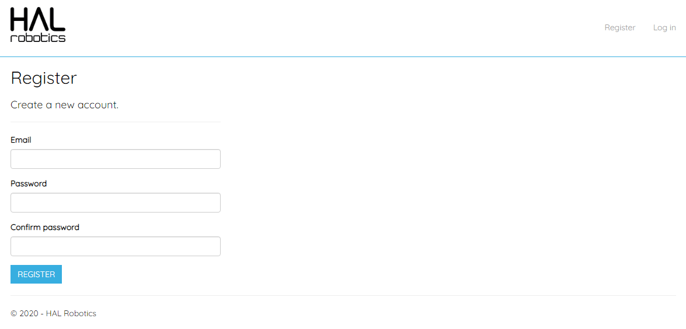](../../assets/images/01UserPortalRegister.PNG)
<em>Register using a valid email address, as it will be used for support and licensing.</em>

[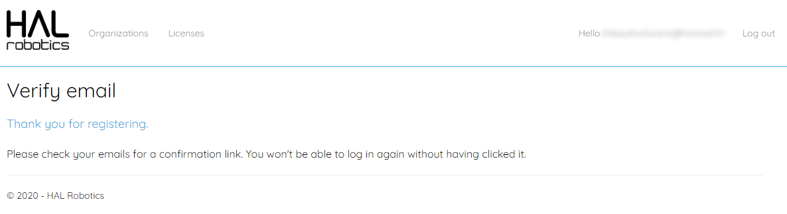](../../assets/images/01UserPortalRegistration.PNG)
<em>Upon validation of your registration details, please verify that our confirmation email is not blocked by your spam filter.</em>

[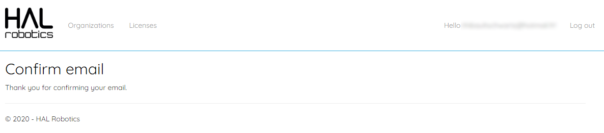](../../assets/images/01UserPortalRegistrationConfirmation.PNG)
<em>A final registration confirmation will be displayed once you click on the link you received via email.</em>

[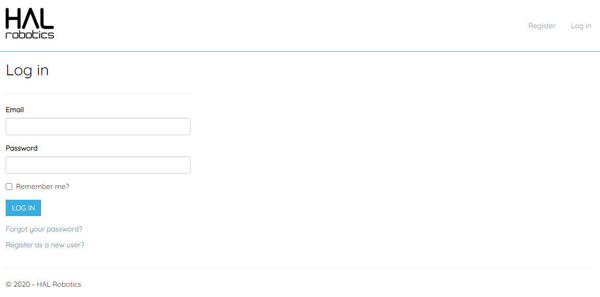](../../assets/images/01UserPortalLogin.PNG)
<em>The login page simply requires your email and password.</em>

On the greeting page you should see a link to [download the HAL Robotics Framework](https://halinstaller.blob.core.windows.net/windows/Setup.exe). By clicking on that link, you will download the HAL Robotics Framework Installer. 

[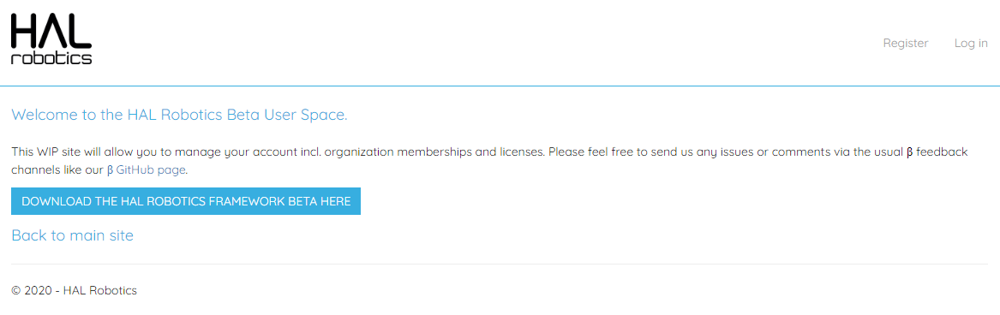](../../assets/images/01UserPortal.PNG)
<em>The [user portal](https://user.hal-robotics.com/) greeting page.</em>

<em>The downloaded "Setup.exe" application will install the HAL Robotics Framework Installer.</em>

Once the download is complete, run the installer and you should see a list of all available packages and extensions. 
Select the ones you want to install according to the robots that you will want to program using the HAL Robotics Framework and the host software you want to add the Framework to. Once you have selected your configuration simply click apply and the installation will start.   
Every time there are updates available for the packages you have installed simply clicking apply will download and install the latest version.   
Once the installation is complete you have successfully installed the HAL Robotics Framework.

[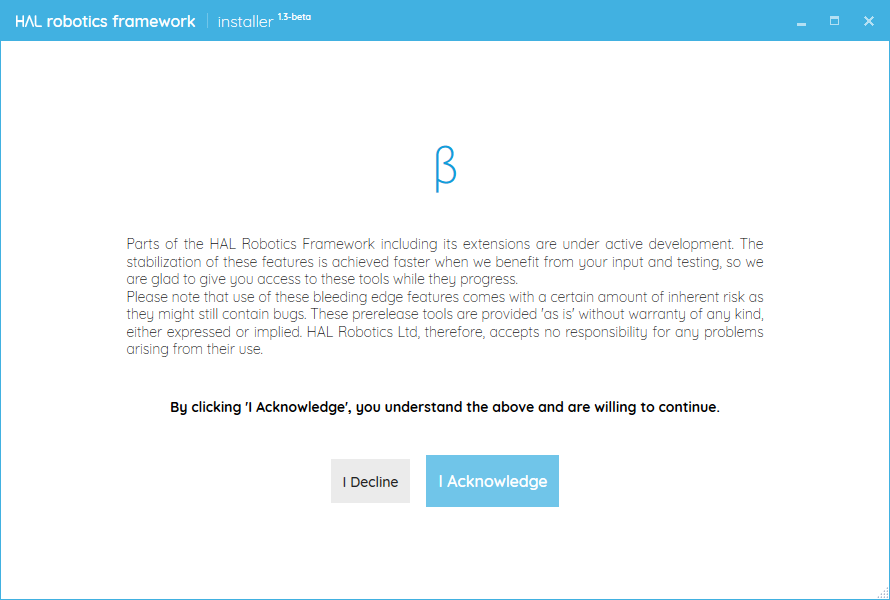](../../assets/images/01InstallerDisclaimer.PNG)
<em>Important information is displayed during the installation phases, please take notice of these elements before using the software.</em>

<em>The HAL Robotics Framework is composed of functionality modules. The installer lets you select the ones you wish to install.</em>

[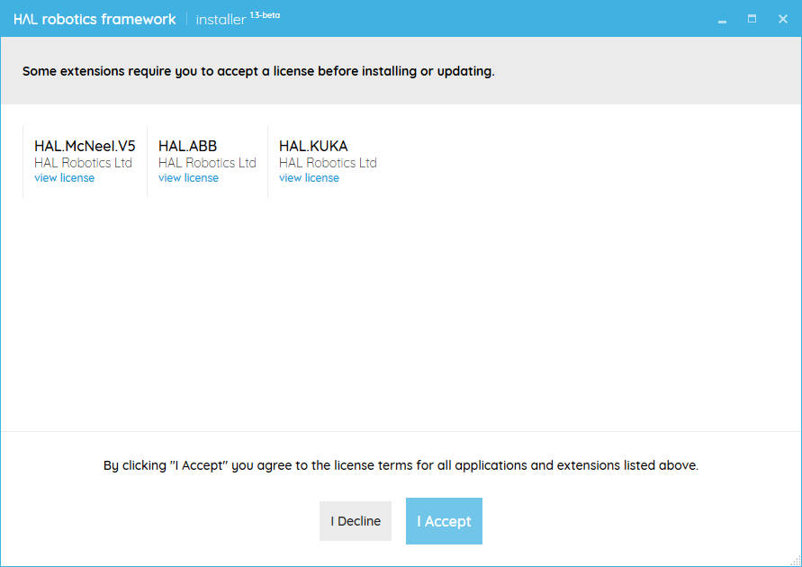](../../assets/images/01InstallerPackageLicenses.PNG)
<em>Each module is distributed with a corresponding End-User License Agreement (EULA), please take notice of these elements before using the software.</em>

[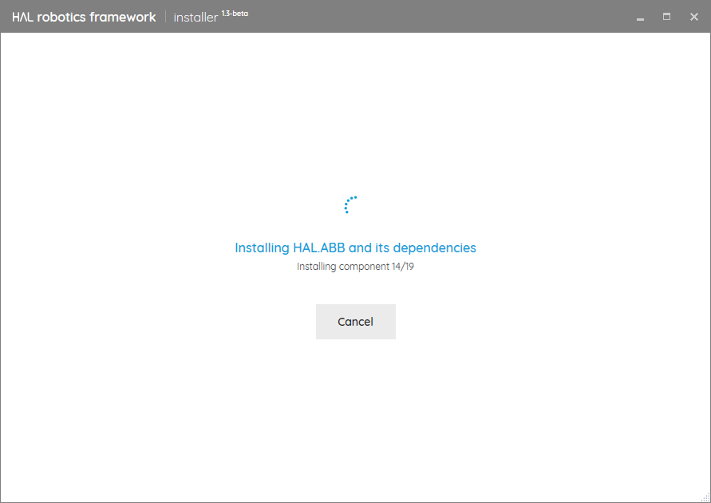](../../assets/images/01InstallerProgress.PNG)
<em>Upon validation of the module selection, the installer will download and install each module and the corresponding dependencies.</em>

[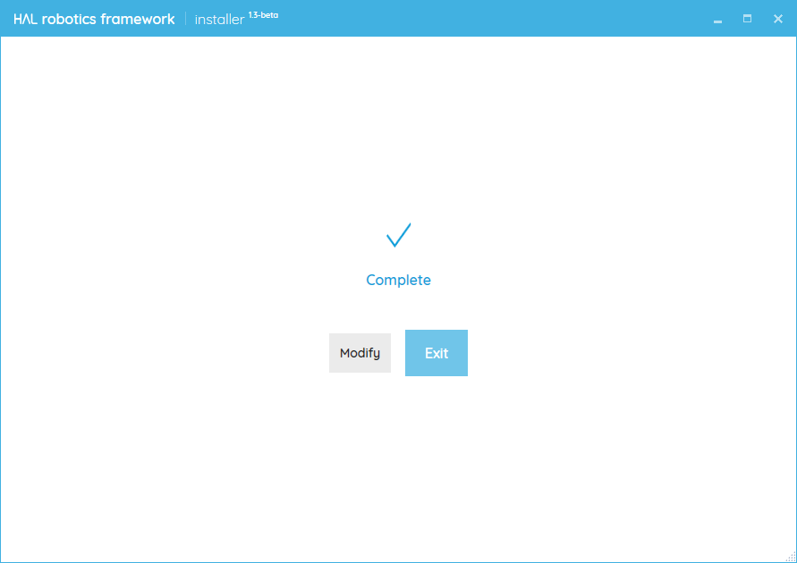](../../assets/images/01InstallerComplete.PNG)
<em>You can exit the installer once the setup is complete.</em>

---
### 0.2. Create and Administer an Organization

#### Objective:

This tutorial is aimed at organization administrators who would like to manage licenses and users for their institution from the [user portal](https://user.hal-robotics.com/). If you are a user trying to access their organization's licenses please skip forward to the "Join an Organization" tutorial.

#### Requirements to follow along:

- Internet access.

#### Background:

Creating an organization will allow members to share floating licenses. This maximizes the usage of your licenses and avoids employees or students leaving with access to a license you've paid for.

#### How to:

Start by browsing to the [user portal](https://user.hal-robotics.com/) and [logging in](https://user.hal-robotics.com/Account/Login). You can then navigate to the [Organizations page](https://user.hal-robotics.com/Organizations). Here you should see a list of any organizations you are already a member of. It's likely that this list is empty at this stage so let's create an organization for you company or institution.  

Click on [Create New](https://user.hal-robotics.com/Organizations/Create) at the top of the page. There are a few details that need to be entered here:
* The name of the organization.
* If your organization is an academic institution then you can tick the "Academic" box.
* You then have the option of listing your organization for all users to join. Being listed will allow members, for example your colleagues or students, to request to join the organization. You will still have the option of rejecting any unsolicited requests. If you un-tick the option then you will remain hidden to all users but will need to manually add any members to your organization.
* All other information is optional but will help to automatically populate information when requesting quotes or purchasing information.
* The "Domain for automatic membership validation" will automatically accept any organizational membership requests from user accounts with a verified email address on the domain you specify e.g. "@example.com" will automatically accept "sarah@example.com" but not "toby@gmail.com". It is entirely optional but could save you some back and forth accepting users in your domain.

[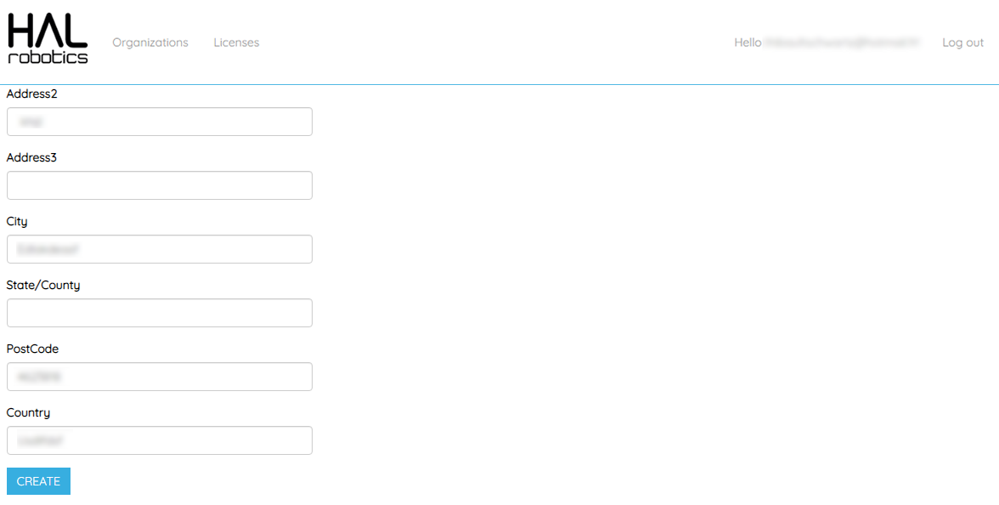](../../assets/images/02CreateOrganization.PNG)
<em>Fill the organization creation form then validate using the Create button.</em>

Click "Create" and you will be redirected to your "Organization Memberships" page. From here you can view the members of the organization or any licenses that have been assigned to the organization. You may have to visit the "Members" page from time to time to accept new requests to join or manually add members. The "Licenses" page can be used to check which licenses are in use and when they expire.

[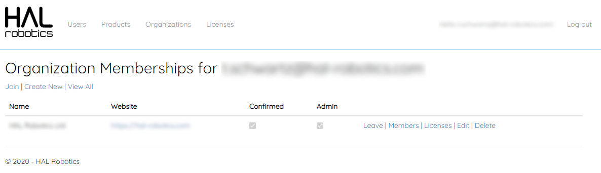](../../assets/images/02Organizations.PNG)
<em>The "Organizations" page displays your memberships.</em>

[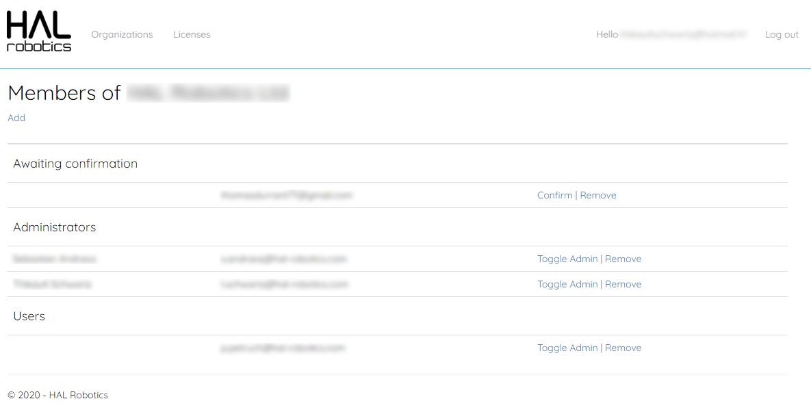](../../assets/images/02OrganizationMembers.PNG)
<em>The "Members" page of an organization displays members and their roles.</em>

[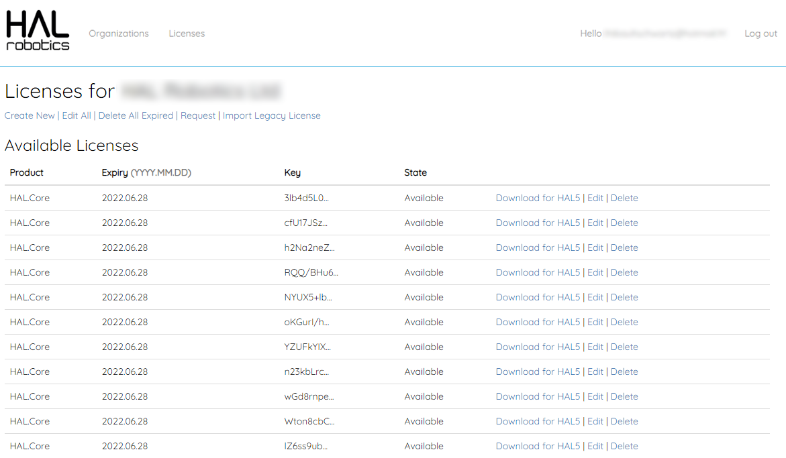](../../assets/images/02OrganizationLicenses.PNG)
<em>The "Licenses" page of an organization displays licenses and their status.</em>

---
### 0.3. Join an Organization

#### Objective:

This tutorial is aimed at users who want to join their organization on the [user portal](https://user.hal-robotics.com/) and access the organization's licenses. If you are unsure of whether your company or institution has an organization please talk to your I.T. department or HAL Robotics Framework admin.

#### Requirements to follow along:

- Internet access.

#### Background:

Joining an organization will allow you to access your organization's licenses.

#### How to:

Start by browsing to the [user portal](https://user.hal-robotics.com/) and [logging in](https://user.hal-robotics.com/Account/Login). You can then navigate to the [Organizations page](https://user.hal-robotics.com/Organizations). Here you should see a list of any organizations you are already a member of. It's likely that this list is empty at this stage so let's join the organization for you company or institution.   
Click on "Join" at the top of the page. Here you will be given a list of organizations that you can request to join. Select your organization from the drop-down and click "Request to Join". If you can't find your organization in the list please talk to your I.T. department or HAL Robotics Framework admin as they may have hidden the organization. In most instances, once you've clicked "Request to Join", an organization administrator will have to approve your request. Once you've been approved and login to any of the HAL Robotics Framework client applications, for example, the Grasshopper plugin, you will have access to your own and your organization's licenses.

[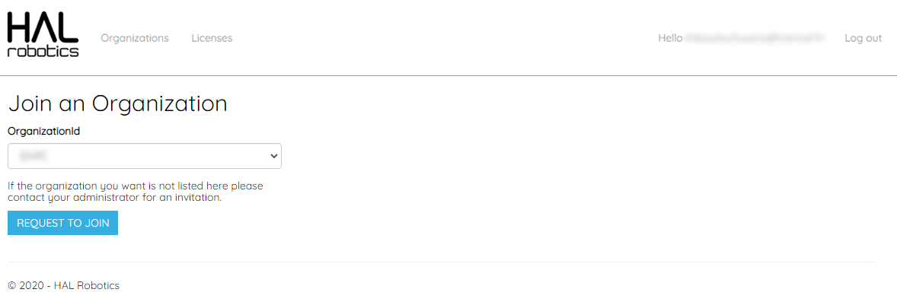](../../assets/images/03JoinOrganization.PNG)
<em>The "Join" page will allow you to look for your organization and request membership.</em>

---
### 0.4. Upload HAL5 Licenses \[Obsolete\]
This tutorial is obsolete as all licenses are distributed through the user portal.

---
### 0.5. Complete Uninstallation

#### Objective:

In this tutorial you'll learn how to completely uninstall the HAL Robotics Framework.

#### Requirements to follow along:

- A PC with the HAL Robotics Framework installed.

#### Background:

Whilst we make every effort to ensure that our software is stable it may occasionally be necessary to completely remove a version of the HAL Robotics Framework.

#### How to:

Start by opening the HAL Robotics Installer and clicking uninstall. This will uninstall all packages and extensions you added through the installer. You can then uninstall the Installer itself through the usual Windows uninstall methods. Once this is done you can clean up any remnants that the uninstallation process may have missed by deleting

a. [%ProgramData%\\HAL](file///%ProgramData%/HAL)
b. %LocalAppData%\\HAL

---