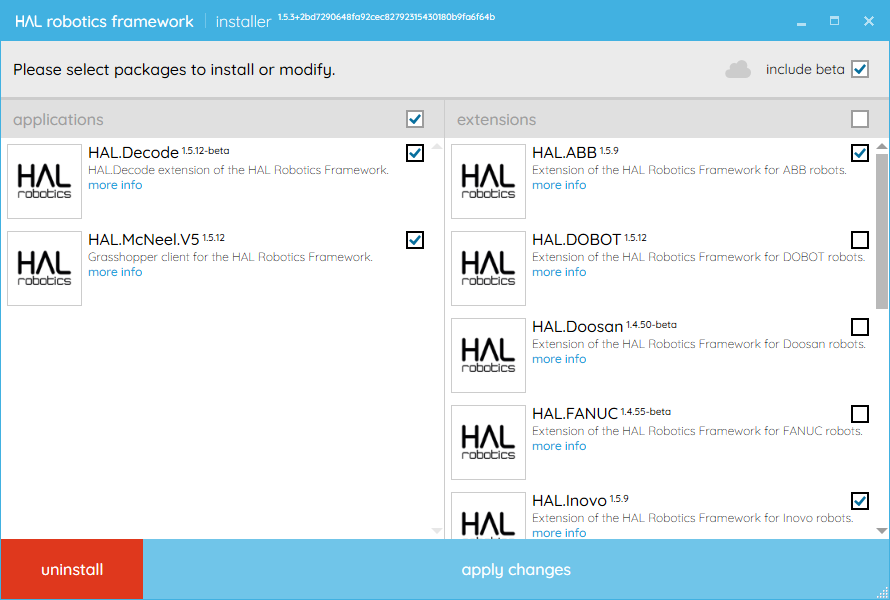

## Custom Extensions

[0.1. Setup](#01-setup)

---
### 0.1. Setup

#### Objective:

In this tutorial we will introduce the components and structure of custom extensions for HAL Robotics Framework.

#### Requirements to follow along:

- Internet access.

#### Background:

The HAL Robotics Framework has been designed as modules to ensure that any unique or specific functionality can be added with relative ease. If you have already installed the software you will have seen a list of some of those modules on the right-hand side of the installer, most of which add functionality, and compatibility, for specific robot OEMs.

<em>The HAL Robotics Framework is composed of functionality modules. The installer lets you select the ones you wish to install.</em>

There are a few different types of modules that we create:
1. Extensions - these are the modules you'll see in the installer which contain compiled code and add logic and functionality to the Framework.
2. Mechanisms - these include robots, positioners, tools etc. which have a physical and, potentially, kinematic structure
3. Controllers - these are the control boxes for robots and are typically reliant on the correct _Extension_ being installed e.g. **HAL.ABB** needs to be installed to load an _ABB_ [Controller](../../Overview/Glossary.md#controller).
4. Parts - these are static physical elements that can be used to populate your [Cell](../../Overview/Glossary.md#cell)

All of the above are distributed as _NuGet packages_, _.nupkg_ files and have structured names which include their version numbers. There are three parts to the naming structure:
1. The Name - a series of dot-separated characters that are normally human readable e.g. _HAL.McNeel_
2. The Version - Three dot-separated numbers indicating the version e.g. _1.5.12_, which represent the Major Version (_1_), the Minor Version (_5_) and the Patch Version (_12_). This may also optionally have a pre-release suffix preceded by a hyphen e.g. _-beta_, which indicates that this is still an unfinished module.
3. The Extension - _.nupkg_

A typical _Extension_ will be named for the functionality that it adds e.g. support for a brand of robot, or a communication protocol whilst _Mechanisms_, _Controllers_ and _Parts_ (collectively _Catalogue Items_ as they are listed in catalogues within the Framework) will have Globally Unique Identifiers (GUIDs) as their names. The latter is admittedly less easy to read but allows us to rename the contents if necessary without breaking the versioning of a particular module.

_Extensions_ may come in multiple parts, more often than not, a "core" module e.g. _HAL.RobotBrand_, a UI module e.g. _HAL.UI.[WPF.]RobotBrand_ and a grouping module that shows up in the installer and ensures all of the others are installed e.g. _HAL.RobotBrand.ExtensionGroup_.

#### How to:

Start by creating two directories somewhere on your PC in which you will store your _Extensions_ and _Catalogue Items_. It is best practice to store _Extensions_ and _Catalogue Items_ separately as they need to be installed in different ways.

##### Extensions

To set up your _Extensions_, open the Installer and select the **manage repositories**, cloud-shaped button in the top right corner.

[

](../../assets/images/Overview/01InstallerPackages-AccessRepositories.png)
<em>The manage repositories button is a cloud in the upper right-hand corner of the installer.</em>

From the repository manager, give your repository an alias and put the path to the directory as the URI, then click **add**. 

[

](../../assets/images/Overview/01InstallerPackages-Repositories.png)
<em>The repository manager allows you to tell the installer where to look for new Extensions.</em>

You will then need to restart the installer for your changes to be taken into account.

If you can't find an extension you're expecting to see it's possible that it's a pre-release version, in which case ensure the **include beta** box is ticked in the installer, as shown below.

[

](../../assets/images/Overview/01InstallerPackages-IncludeBeta.png)
<em>The include beta box in the upper right-hand corner of the installer shows you packages which are still under development.</em>

##### Catalogue Items

To set up your _Catalogue Items_, open Rhino3D and Grasshopper, navigate to the **HAL** menu and select the **catalog repositories** option.

[

](../../assets/images/Overview/01CataloguePackages-AccessRepositories.png)
<em>The catalog repositories option accesses the catalogue item repository manager.</em>

From the repository manager, give your repository an alias and put the path to the directory as the URI, then click **add**. 

[

](../../assets/images/Overview/01CataloguePackages-Repositories.png)
<em>The repository manager allows you to tell the installer where to look for new catalogue items.</em>

You will then need to restart the Framework for your changes to be taken into account. When you reload the Framework you will need to look for the **Scan Online Content** button in lower left-hand corner of your catalogue window to list any items you haven't yet used.

---

Continue to: 1. Getting Started for [_decode_](../../decode/1-Getting-Started/Contents.md#1-getting-started) or the [Grasshopper SDK](../../Grasshopper/1-Getting-Started/Contents.md#1-getting-started)