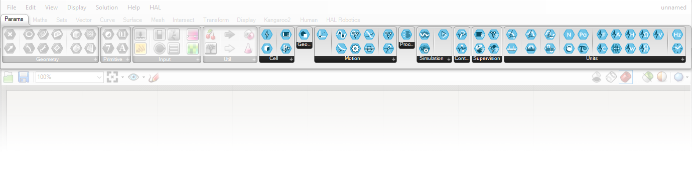

## 1. Getting Started

[1.0. The Beta](#10-the-beta)

[1.1. Projects](#11-projects)

[1.2. Structure](#12-structure)

[1.3. Interface Overview](#13-interface-overview)

[1.4. Variables](#14-variables)

[1.5. Assets](#15-assets)

---
### 1.0. The Beta

#### Welcome to the FlowBuilder by HAL Robotics Beta!:

FlowBuilder's primary purpose is to give operators, those with expert process knowledge, enough agency to adapt a robot's task without burdening them with the complexities of programming. For system integrators and roboticists, however, it serves as a means of quickly setting up complex robotic toolpaths, simulating and validating those procedures, and then sending them as native robot code to your machines.

FlowBuilder is built on top of the HAL Robotics Framework which has been in use for nearly a decade in different guises within multi-nationals, SMEs, research institutions and academia. So, whilst FlowBuilder is a new user interface and workflow, the Framework under the hood is stable.

That being said, the interface is new so we know there will be issues and instabilities within it, hence the need for a Beta. As such, we recommend erring on the side of caution when using physical hardware and running simulations in OEM tools wherever possible to ensure everything works as expected. Please also read the next two sections which cover [known limitations](#current-limitations) and [feedback procedures](#feedback).

#### Current Limitations:

1. We are using [McNeel's Rhinoceros 3D and Grasshopper](https://www.rhino3d.com/download) as a visualisation engine within FlowBuilder and as such it will need to be installed before you can install FlowBuilder. We are working with McNeel to automate this process for you and will be working with them to simplify the licensing of the complete software so that there's a single point of entry, account management etc. when using FlowBuilder.
2. FlowBuilder currently in Beta, so you will need to ensure the **include beta** box is ticked in the installer before it will be shown.
3. **Save** is currently disabled. We are still working out the final details of how and where we store data which means that we will almost certainly break any previously saved projects. Whilst we know this will be frustrating we hope it will discourage particularly time-consuming development and therefore limit the frustrations of losing that work anyway further down the line. This is a top priority for us and **save** will be coming soon™.
4. Things will be getting fixed and updated very frequently so there will be weekly or maybe even daily updates pushed so please check back in the installer before launching the software on any given day. Once it's stable, the update cadence will slow and this will no longer be necessary, although we will still keep releasing meaningful feature updates, tweaks and fixes as necessary.
5. Whilst you will have to log in to FlowBuilder, the licensing has been deactivated so you will, for now, have free access to everything in there. We will try to ensure you get fair warning before that changes.
6. As mentioned above, this is a Beta interface so there are likely to be anomalies, a few bugs and maybe even the occasional crash. We would like as much [feedback](#feedback) as you can give.

#### Feedback:

We appreciate your support helping us make FlowBuilder a stable interface that you can trust for your development needs now and hopefully long into the future. If you find any bugs or major issues please let us know, preferably through our [GitHub issues or discussions](https://github.com/HALRobotics/Beta) so that anyone else with the same experience can chime in and, if need be, help us pinpoint the source of the error. Please give us as much detail as possible as that will ensure we can reproduce the problem internally and therefore identify, and fix, the root cause rather than the symptom.

We would also be very receptive to anything that could make your experience better. That could be features you'd like to see, interactions that could be improved or any other suggestions you have. Again if those go through our [GitHub page](https://github.com/HALRobotics/Beta/discussions) then we can have an open discussion about how those would work and get input from others on the same subject.

Of course, if you have anything nice to say about FlowBuilder then we'd love to hear that too, on [GitHub](https://github.com/HALRobotics/Beta/discussions), by [email](mailto:the-team@hal-robotics.com) or in whatever public forum you feel is appropriate.

Thank you once again for helping to make FlowBuilder better.

---
### 1.1. Projects

#### Objective:

In this tutorial we'll see how to create a HAL Robotics FlowBuilder Project so we can start programming robots.

#### Requirements to follow along:

- HAL Robotics FlowBuilder installed on a PC. See [Installation](../../Overview/0-Administration-and-Setup/Contents.md#01-install) if you need to install the software.

#### Background:

FlowBuilder will enable you to prepare a complete robot programming environment and we store all of the data associated to that environment in a **Project**. The **Project** is a folder with a series of files, each of which holds different information about the environment you've created or are using.

#### How to:

Once you've opened FlowBuilder, and logged in to the HAL Robotics Framework to access your licenses, you should be presented with a list of **Projects** that are stored on your PC. If this is the first time you're opening the software, this list may well be empty. By default, all your **Projects** will be stored in a folder within you _Documents_ folder but you can change that by clicking on **change projects folder** in the bottom right-hand corner of the window. If you want to shared **Projects** between multiple computers, you could set this folder to be somewhere on a networked drive.

If the **Project** you want to open is listed, you can open it by either double-clicking, or clicking once to select, then on the **open** button.

If this is your first **Project** or you want to start a new **Project**, click on the **new** button in the upper right-hand corner. This will take you to a new screen where you can give the **Project** a _Name_ and _Description_ to help you identify it in the list next time you open FlowBuilder. The _Name_ will also be the final part of the _Destination_ path and we will alert you if that _Name_ is already in use.

Once you're happy with those details, click **ok**. We will create that **Project** for you and automatically open it ready for you to start your new endeavour.

---
### 1.2. Structure

#### Objective:

In this tutorial we'll outline FlowBuilder's structure to ensure you have a high-level understanding of the steps required to work with it.

#### Background:

FlowBuilder's ultimate aim is to provide an operator, [Robot](../../Overview/Glossary.md#manipulator)(s) and any other peripherals with a set of shared work instructions. These instructions will guide the operator through their task and ask them to make decisions about how the robot's process(es) should be undertaken, combining the operator's intelligence and expert knowledge with the speed, accuracy and tirelessness of the [Robot](../../Overview/Glossary.md#manipulator). To get that setup, there are a few steps you'll need to go through.

First is the [Cell Setup](../2-Cell/Contents.md#2-cell-setup). This covers everything you'll need to build up a virtual version, or digital twin, of your robotic [Cell](../../Overview/Glossary.md#cell). This includes selecting your [Robots](../../Overview/Glossary.md#manipulator), [Tools](../../Overview/Glossary.md#end-effector), [References](../../Overview/Glossary.md#reference), and [Parts](../../Overview/Glossary.md#part) as well as set up your [I/O Signals](../../Overview/Glossary.md#signal) and assemble all of these into a complete digital system through a [Controller](../../Overview/Glossary.md#controller). This is done in the **Scene** and **Network** tabs, the first two in the list on the left-hand-side of your screen.

Then comes [Programming](../3-Programming/Contents.md#3-programming). This is the next tab down and will allow you to define the [Procedures](../../Overview/Glossary.md#procedure) which tell the [Robots](../../Overview/Glossary.md#manipulator) in your [Cell](../../Overview/Glossary.md#cell) what to do, and how they should do it.

With a virtual [Cell](../../Overview/Glossary.md#cell) and [Procedures](../../Overview/Glossary.md#procedure) in place, we can start working on the [Operator Workflows](../4-Workflows/Contents.md#4-operator-workflows). These contain the instructions for the operator and the [Cell](../../Overview/Glossary.md#cell) and could include things like asking the operator to load a [Part](../../Overview/Glossary.md#part), asking the operator how fast the robot should go on the next run, or start the execution of the [Robot's](../../Overview/Glossary.md#manipulator) [Procedures](../../Overview/Glossary.md#procedure). [Operator Workflows](../4-Workflows/Contents.md#4-operator-workflows) are created in the **Workflow Editor** tab, and run from the **Workflow Executor** tab which is just after the blue line, and the only one an operator should need.

The two tabs we've glossed over are for the management of [Variables](#14-variables) and [Assets](#15-assets). They aren't part of the core flow but are useful when you need them so it is worth reading up on them below. 

---
### 1.3. Interface Overview

#### Objective:

In this tutorial we'll take a look at the layout of FlowBuilder and the common patterns you'll find throughout the software.

#### Background:

On the far left hand side of FlowBuilder, there is a set of vertical tabs. Each of these tabs will take you to a new screen with a different purpose, each of which is outlined above in [Structure](#12-structure). To the right of the screens is your 3D viewport. That will show you the [scene](../2-Cell/Contents.md#2-cell-setup) that you've built including all of the components of your [Cell](../../Overview/Glossary.md#cell), your [Procedures](../../Overview/Glossary.md#procedure) and your [Simulations](../../Overview/Glossary.md#73-simulation). You can move around/pan in the viewport by pressing and holding the left mouse button, and rotate/orbit by pressing and holding the right mouse button.

The actual content of each screen will vary depending on what it's designed to configure but as a general rule you'll find a collection of items that can be created, edited, manipulated or deleted. The colour of those items will indicate their state. 
Let's use the [scene](../2-Cell/Contents.md#2-cell-setup) screen as an example. 

At the top of the screen you'll see the _Item Type_ selector which allows you to specify the kind of item to create. **It's important to note that the options in the selector are contextual, that is to say, they change based on what is selected in the rest of the screen and potentially any existing content.** For example, you can't attach anything but a [Tool](../../Overview/Glossary.md#end-effector) to a [Robots](../../Overview/Glossary.md#manipulator) or anything at all to a [Controller](../../Overview/Glossary.md#controller). This is because whatever you add next will be a _child_ of the selected item but you can deselect the current item by clicking in any part of the screen's white space.
Next to the selector is a **+** which will add that item to [scene](../2-Cell/Contents.md#2-cell-setup) and open it up for editing straight away. Once you've added a few items to the [scene](../2-Cell/Contents.md#2-cell-setup), you can change their order or who is attached to whom by dragging and dropping the items. Drag and drop behaviours are also contextual, so if you can't drop an item somewhere it's likely for a good reason.

 
<em>The FlowBuilder scene screen.</em> 

If we add a [Reference](../../Overview/Glossary.md#reference) we can see a standard item editor screen. At the very top is the item's _Name_. This can, and should, be changed to identify the item more easily and, in the case of items that get [exported](../../Overview/Glossary.md#export) to robot code, will be the [exported](../../Overview/Glossary.md#export) name. You can also rename items from the main screens by right-clicking on them or selecting them and pressing _F2_. The **ok** button here finishes editing of the item and closes the editor. You can always return to an editor by double-clicking the item or selecting it and using the _edit_ icon in the top right-hand corner of the screen. 
Immediately below that top row is a _Creator_ selector. This allows you to choose how you want to create the item. In the case of a [Reference](../../Overview/Glossary.md#reference), the choices are **From Location** or **From Variable**. Each _Creator_ has a _Wizard_ which contains a series of _Steps_ that configure the item. Each _Step_ has a coloured dot on its left which indicates whether running the _Step_ succeeded or not. Its border will also change colour if the data you have input isn't valid. If that's the case, it will need to be fixed before we attempt to run the _Step_ again. Some _Steps_ have default values which means they are valid when created, others don't and will need to be edited before anything can happen.
Any _Step_ that can be edited has an icon to indicate that fact. Any other _Steps_ are uneditable. You can start editing the _Step_ by clicking anywhere on the _Step_ but only one _Step_ can be edited at a time.

 
<em>The FlowBuilder Reference editor.</em> 

##### Locations
By clicking on the **Location** _Step_, we see a fairly standard editor view. Some settings require selections from a list of options, others are numeric values and they should make sense in the context. Hovering over the setting's name should give you some additional guidance if you need it. By changing the **Position** or **Rotation** values you'll see the [Reference](../../Overview/Glossary.md#reference) in your [scene](../2-Cell/Contents.md#2-cell-setup) move. We provide this kind of immediate visual feedback wherever possible and that means that changes are immediately applied. If the setting has a **🔗** symbol, it means that setting can be linked to a [Variable](#14-variables) which you can find out more about below.

 
<em>The FlowBuilder Reference editor with the Location Step being edited.</em> 

##### Translation Overrides
The **Translation Overrides** _Step_ is common amongst items that will be [exported](../../Overview/Glossary.md#export) to robot code and shows another setting type, the toggle. You'll find these dotted around the software and they will allow you to activate or deactivate other, optional settings. In this case, whether or not you want to change how the _Name_ of the [Reference](../../Overview/Glossary.md#reference) is [exported](../../Overview/Glossary.md#export), and if so, how.

 
<em>The FlowBuilder Reference editor with the Translation Override Step being edited.</em> 

There are a few other settings types that you'll find within the software that are worth being aware of.

* **Catalogue** settings will load a catalogue of presets in a new window. Double clicking on, or selecting, an item will close the catalogue and return you to the editor.

 
<em>The robot catalogue.</em> 

* **Nested Wizards** are _Wizards_ within _Wizards_. They are mainly used to group _Steps_ or allow you to swap between a different set of _Steps_ for a single operation, and work just like the normal _Wizards_.

 
<em>A nested Wizard.</em> 

* **Menus** store a few extra commands in certain screens, generally for adding or removing entire collections. Their content changes based on the screen they're on.

 
<em>A menu button.</em> 

* **Selectors** allow you to select items from your 3D viewport. They have their own collection of items which you can add to or remove from but can also have constraints like allowing only a single item. A pop-up at the top of the viewport will give you extra information during the selection process.

 
<em>A selector in action.</em> 

--- 
### 1.4. Variables

#### Objective:

In this tutorial we'll look at the **Variable** manager and how it can help you manage your variables in FlowBuilder.

#### Background:

Coming soon.

---
### 1.5. Assets

#### Objective:

In this tutorial we'll look at the **Assets** manager and how it can help you manage your imported assets in FlowBuilder.

#### Background:

Coming soon.

---

[Continue to: 2. Cell Setup](../2-Cell/Contents.md#2-cell-setup)